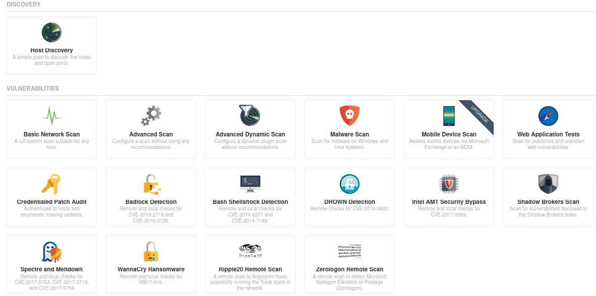
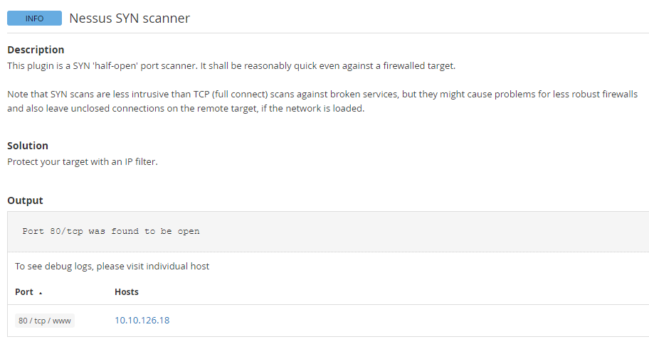
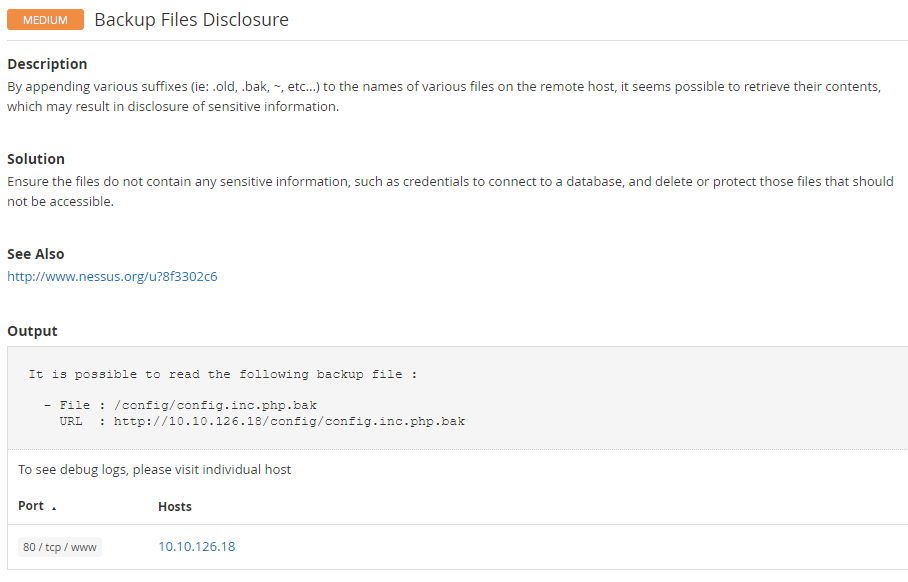
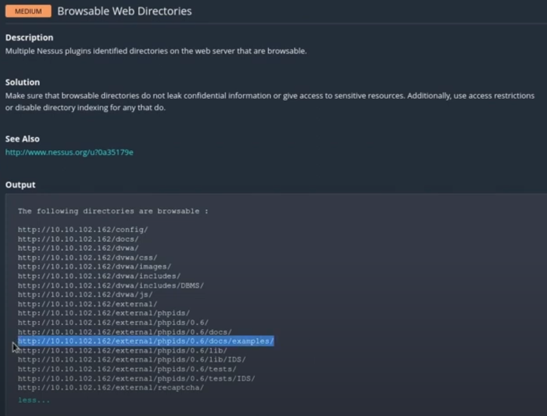
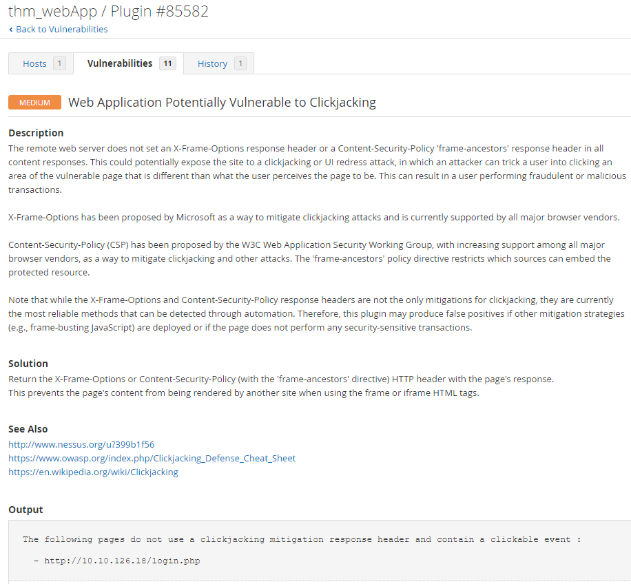

# Nessus

Learn how to set up and use Nessus, a popular vulnerability scanner.

[Link](https://tryhackme.com/room/rpnessusredux)

# 1: Introduction

Nessus vulnerability scanner is exactly what you think is its! A vulnerability scanner!

It uses techniques similar to Nmap to find and report vulnerabilities, which are then, presented in a nice GUI for us to look at.

Nessus is different from other scanners as it doesn't make assumptions when scanning,

like assuming the web application is running on port 80 for instance.

  

Nessus offers a free and paid service, in which some features are left out from the free version to make you more inclined to buy the paid service. 

Their pricing is similar to Burp Suite, so unless you got some spare change, we will be just be using their free version.

  

You can check out their pricing options here: [https://www.tenable.com/products/nessus](https://www.tenable.com/products/nessus)

# 2: Installation

   

We will be installing Nessus on a Local Kali VM.

**Warning**: Do **not** install Nessus on the **THM AttackBox**. It will **not** work, as there's no sufficient space!

Other OS's **will not** be covered in this walkthrough, in which case the official installation guide can be found below. 

 [https://docs.tenable.com/nessus/Content/GettingStarted.htm](https://docs.tenable.com/nessus/Content/GettingStarted.htm)  

_**Answer the questions below**_

**Step #1**

Goto [https://www.tenable.com/products/nessus/nessus-essentials](https://www.tenable.com/products/nessus/nessus-essentials) and register an account.

**You will need to do this for an activation code.**

**Step #2**  

We will then download the Nessus-#.##.#-debian6\_**amd64.**deb file

Save it to your **/Downloads/** folder

**Step #3**

In the terminal we will navigate to that folder and run the following command:  

sudo dpkg -i **package\_file.deb**

Remember to replace package\_file.deb with the file name you downloaded.

**Step #4**

We will now start the Nessus Service with the command:  

**sudo /bin/systemctl start nessusd.service**

**Step #5**

Open up Firefox and goto the following URL:  

[https://localhost:8834/](http://localhost:8834/) 

You may be prompted with a security risk alert.

Click **Advanced...** -> **Accept the Risk and Continue**

**Step #6**

Next, we will set up the scanner.  

Select the option **Nessus Essentials**

  

Clicking the **Skip** button will bring us to a page, which we will input that code we got in the email from Nessus. 

  

**Step #7**

Fill out the **Username** and **Password** fields. Make sure to use a strong password!

  

**Step #8**

Nessus will now install the **plugins** required for it to function.

This will take some time, which will depend on your internet connection and the hardware attached to your VM.

If the progress bar appears to be **not moving**, it means you do not have **enough space** on the VM to install. 

**Step #9**  

**Log in** with the account credentials you made earlier. 

  

**Step #10**

You have now successfully installed **Nessus**!

  

# 3: Navigation and Scans

_**Answer the questions below**_

What is the name of the button which is used to launch a scan?

- New Scan

What side menu option allows us to create custom templates?

- Policies

What menu allows us to change plugin properties such as hiding them or changing their severity?

- Plugin Rules

In the 'Scan Templates' section after clicking on 'New Scan', what scan allows us to see simply what hosts are alive?

- Host Discovery

One of the most useful scan types, which is considered to be 'suitable for any host'?

- Basic Network Scan

What scan allows you to 'Authenticate to hosts and enumerate missing updates'?

- Credentialed Patch Audit

What scan is specifically used for scanning Web Applications? 

- Web Application Tests

# 4: Scanning!

**Run a Network Scan!**   

_**Answer the questions below**_

Create a new '**Basic Network Scan**' targeting the deployed VM. What option can we set under '**BASIC**' (on the left) to set a time for this scan to run? This can be very useful when network congestion is an issue.

- Schedule

Under 'DISCOVERY' (on the left) set the 'Scan Type' to cover ports 1-65535. What is this type called?

- Port scan (all ports)

What 'Scan Type' can we change to under 'ADVANCED' for lower bandwidth connection?

- Scan low bandwidth links

With these options set,  launch the scan. 

After the scan completes, which 'Vulnerability' in the 'Port scanners' family can we view the details of to see the open ports on this host?

- Nessus SYN scanner

What Apache HTTP Server Version is reported by Nessus?

- 2.4.99

# 5: Scanning a Web Application!

  

**Run a Web Application scan on the VM!**

**(Running this Scan will take some time to complete, please be patient)**

_**Answer the questions below**_

What is the plugin id of the plugin that determines the HTTP server type and version?

- 10107

What authentication page is discovered by the scanner that transmits credentials in cleartext?

- login.php

What is the file extension of the config backup?

- .bak

Which directory contains example documents? (This will be in a php directory)

- /external/phpids/0.6/docs/examples/

What vulnerability is this application susceptible to that is associated with X-Frame-Options?

- Clickjacking

